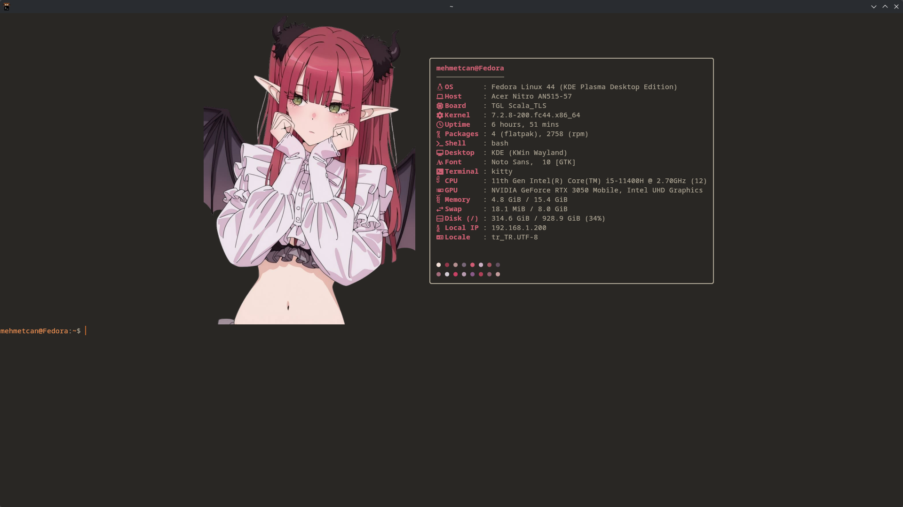
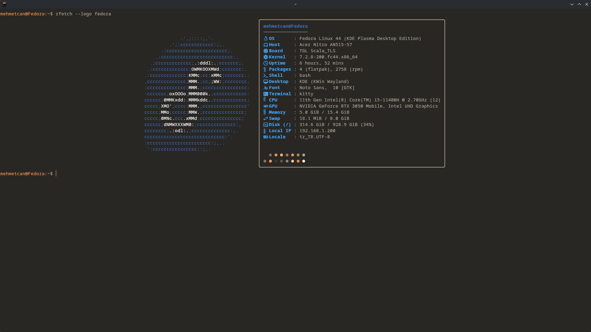
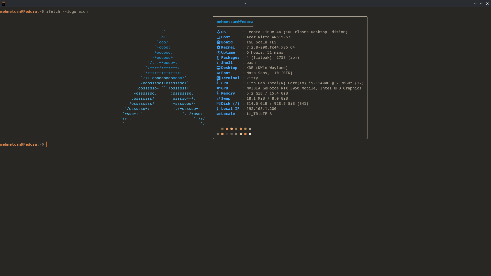
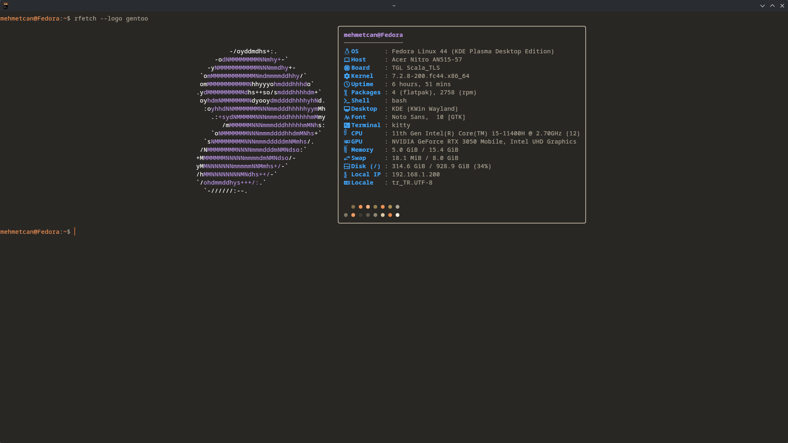
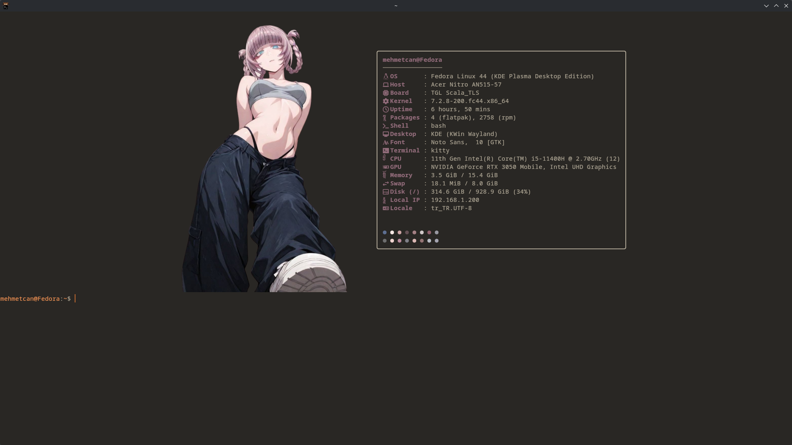
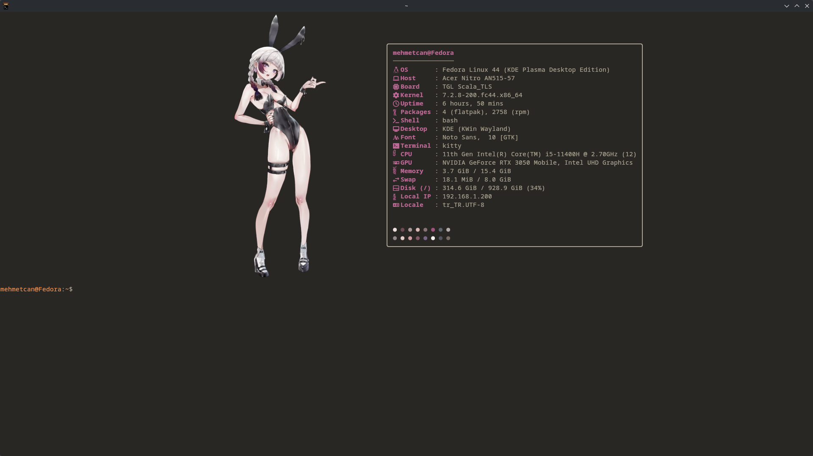

# RustFetch

**RustFetch** is a blazing-fast (~4ms), memory-safe, and highly customizable system information fetch tool for Linux, written entirely in pure Rust.

Designed as a modern, zero-fork alternative to `neofetch` and `fastfetch`, RustFetch matches or beats the native performance of C-based fetchers by querying Linux `sysfs` and `procfs` directly, avoiding expensive subprocess invocations entirely.

```
       /\         mehmetcan@fedora
      /  \        -----------------
     /\   \       OS: Fedora Linux 41 (Workstation Edition) x86_64
    /      \      Host: Katana GF66 11UC (REV:1.0)
   /   ,,   \     Kernel: 6.13.1-200.fc41.x86_64
  /   |  |  -\    Uptime: 4 hours, 12 mins
 /_-''    ''-_\   Packages: 2418 (rpm), 12 (flatpak)
                  Shell: bash 5.2.32
                  Display: 1920x1080 @ 144Hz
                  DE: GNOME 47.2
                  WM: Mutter (Wayland)
                  Terminal: alacritty
                  CPU: 11th Gen Intel i5-11400H (12) @ 4.500GHz
                  GPU: NVIDIA GeForce RTX 3050 Mobile
                  Memory: 3.84 GiB / 15.38 GiB (24%) [■■■-------]
                  Battery: 100% [Full]
                  Wi-Fi: CanHome (70dBm - 60%)
                  Processes: 342 (load: 0.42)
                  Palette: ● ● ● ● ● ● ● ●
```

---

## 📸 Showcase & Screenshots

<p align="center">
  
</p>

<details open>
<summary><b>🖼️ More Screenshots & Distro Themes (Click to expand/collapse)</b></summary>
<br>

| Fedora Linux (ASCII + Border) | Arch Linux (ASCII + Border) |
| :---: | :---: |
|  |  |

| Gentoo Linux (ASCII + Border) | Kitty Image Mode + Adaptive Palette |
| :---: | :---: |
|  |  |

| Custom Image Mode (Minimal Card) |
| :---: |
|  |

</details>

---

## 📚 Complete Documentation Hub (`docs/`)

Explore dedicated, in-depth guides for every single customization feature in RustFetch:

| No | Guide | Description |
|---|---|---|
| **01** | [**Configuration & Quick Start**](docs/01-configuration.md) | `config.toml` hierarchy, Fastfetch auto-import, CLI flags, and layout sizing. |
| **02** | [**Colors, Themes & Gradients**](docs/02-colors-themes-gradients.md) | HEX/RGB TrueColor, 13+ built-in themes (Catppuccin, Dracula, Tokyo Night), and linear gradients. |
| **03** | [**Boxes, Borders & Image Frames**](docs/03-boxes-and-borders.md) | 8 container styles, custom 11-char `border_chars`, titles, dividers, and **Image Borders** (`border_image`). |
| **04** | [**Custom ASCII Art**](docs/04-ascii-art.md) | Custom ASCII art, 2D/3D extrusion, and Neofetch `$1..$6` color variable substitution. |
| **05** | [**Images & Graphics Protocols**](docs/05-images-and-protocols.md) | Kitty, Sixel, iTerm2, and half-block rendering, random wallpaper galleries, and auto-color extraction. |
| **06** | [**3D Terminal Graphics Engine**](docs/06-3d-terminal-engine.md) | Real-time 3D ASCII mesh extrusion, relief heightmaps, Blinn-Phong lighting, and sub-cell rasterization. |
| **07** | [**ASCII Animations & GIF Player**](docs/07-ascii-animations-gifs.md) | Frame-by-frame ASCII animation player, GIF/MP4 conversion guide, zero-flicker double buffering. |
| **08** | [**Modules & Nerd Font v3 Icons**](docs/08-modules-and-icons.md) | All 28+ telemetry collectors, modern Nerd Font v3 icons, distro-aware OS glyphs, progress bars & custom shell commands. |
| **09** | [**Layout Presets Showcase**](docs/09-presets-showcase.md) | Showcase of `card`, `dots`, `clean`, `neofetch`, `brackets`, `retro`, `minimal`, `modern`, and `compact`. |

---

## Key Features

* **Universal Distro Support:** Native ASCII logos and pure-filesystem package counters for Fedora, Arch, Ubuntu, Debian, Alpine, Void, NixOS, Gentoo, openSUSE, Mint, Manjaro, Pop!_OS, EndeavourOS, Kali, SteamOS, Artix, Red Hat / CentOS / Rocky / Alma.
* **Modern Nerd Font v3 Glyphs:** Crisp, non-broken Material Design symbols for every module, plus distro-aware OS icons (Arch `󰣇`, Fedora `󰣛`, Ubuntu `󰕈`, Debian `󰣚`, NixOS `󱄅`, Gentoo `󰣨`).
* **Ultra-Deep Ricing & Theming:** 13+ built-in color themes (Catppuccin Mocha/Latte/Macchiato/Frappé, Dracula, Tokyo Night, Gruvbox, Nord, Rosé Pine, Cyberpunk, Monokai, OneDark, Solarized), 24-bit TrueColor linear text gradients, and Neofetch `$1..$6` color replacements.
* **Advanced Box & Border Engine:** 8 built-in border styles (`ascii`, `light`, `heavy`, `double`, `rounded`, `brackets`, `dots`, `block`), custom 11-char strings (`border_chars`), colored borders, embedded titles (`╭── System ────╮`), and section divider lines (`├── Hardware ──┤`).
* **Image Borders & Decorative Frames (`border_image`):** Compose telemetry cards with any PNG/JPG/WebP illustration on the left, right, top, bottom, or both sides as a frame, rendered via TrueColor ANSI half-blocks.
* **Universal Terminal Compatibility:** Seamlessly adapts across GUI emulators (Kitty, Alacritty, Ghostty, Foot, WezTerm), Linux Virtual Consoles (`TERM=linux` automatically downsamples 24-bit TrueColor to 16 ANSI colors), dumb terminals, and standard `NO_COLOR` environments.
* **Microsecond Execution (~4ms):** Reads hardware topology directly from `/sys/bus/pci/devices`, `/sys/class/drm`, and `/proc`, bypassing `lspci`, `xrandr`, and shell sub-processes.
* **Built-in Presets (`--preset`):** Instant layouts including `card`, `dots`, `clean`, `neofetch`, `brackets`, `retro`, `minimal`, `modern`, and `compact`.
* **Microsecond Telemetry Profiler (`--benchmark`):** Profile exact microsecond execution latency across all active telemetry modules with visual progress bars.
* **Fastfetch Auto-Migration:** Automatically inspects existing Fastfetch configurations (`~/.config/fastfetch/config.jsonc`) in a read-only manner on first run. Migrates module ordering, custom icons, and logo paths to `~/.config/rustfetch/config.toml` without modifying your Fastfetch setup.
* **Modern Image Rendering:** Full support for the Kitty graphics protocol (`protocol = "kitty"`), Sixel, iTerm2, and universal TrueColor ANSI half-block rendering (`protocol = "halfblock"`).
* **Native Dominant Color Extraction (`auto_color`):** Automatically extracts vibrant accent colors from images in pure Rust using HSV saturation scoring.
* **Dual Commands (`rustfetch` & `rfetch`):** Both standard and short executable names are installed out of the box with shell completions (Bash, Zsh, Fish) and a UNIX man page (`man rustfetch`).

---

## Performance & Benchmarks

RustFetch is engineered under the philosophy that system information tools should never slow down terminal startup.

### Comparative Benchmark

*Measurements on Intel Core i5-11400H (Fedora Linux, warmed caches, 50-iteration average).*

| Fetch Tool | Language | Execution Time | Architecture Notes |
| :--- | :--- | :--- | :--- |
| **RustFetch** | **Rust** | **~4.2 ms** | Direct `sysfs`/`procfs` parsing, pure Rust EDID decoding, zero subprocesses. |
| **Fastfetch** | C | ~6.0 ms | Highly optimized C, dynamic library linking. |
| **Neofetch** | Bash | ~250.0 ms | Spawns dozens of shell forks (`awk`, `sed`, `grep`, `lspci`). |

### Profiling with `--benchmark`

RustFetch includes a built-in profiler that measures every collector's microsecond footprint:

```bash
rustfetch --benchmark
```

```text
============================================================
              RustFetch Execution Benchmark
============================================================
  os               │    42 µs │ ▓▒░░░░░░░░░░░░░░░░░░░░░░░░░
  host             │    18 µs │ █░░░░░░░░░░░░░░░░░░░░░░░░░
  kernel           │     8 µs │ █░░░░░░░░░░░░░░░░░░░░░░░░░
  uptime           │     9 µs │ █░░░░░░░░░░░░░░░░░░░░░░░░░
  packages         │   480 µs │ ▓▓▓▓▓▓▓▓▓▓▓▓▓▓▓▓▓▓▓▓▓▓▓▓▓▓▓
  display          │   120 µs │ ▓▓▓▓▓▓█░░░░░░░░░░░░░░░░░░░
  cpu              │    65 µs │ ▓▓▓█░░░░░░░░░░░░░░░░░░░░░░
  gpu              │    95 µs │ ▓▓▓▓▓░░░░░░░░░░░░░░░░░░░░░
  memory           │    22 µs │ █░░░░░░░░░░░░░░░░░░░░░░░░░
  wifi             │   310 µs │ ▓▓▓▓▓▓▓▓▓▓▓▓▓▓▓▓▓░░░░░░░░░
  processes        │   180 µs │ ▓▓▓▓▓▓▓▓▓▓░░░░░░░░░░░░░░░░
------------------------------------------------------------
  Total Pipeline   │  1.34 ms
============================================================
```

---

## Installation

### 1. One-Line Install (Recommended)

Universal installer for any Linux distribution. Compiles optimized release binary, sets up symlinks (`rustfetch` and `rfetch`), installs man pages and shell completions:

```bash
curl -fsSL https://raw.githubusercontent.com/MehmetCanWT/rustfetch/main/install.sh | bash
```

### 2. Arch Linux (AUR / PKGBUILD)

```bash
git clone https://github.com/MehmetCanWT/rustfetch.git
cd rustfetch/packaging/arch
makepkg -si
```

### 3. Fedora / RHEL / CentOS

An RPM spec file is included at `packaging/rpm/rustfetch.spec`:

```bash
rpmbuild -ba packaging/rpm/rustfetch.spec
```

### 4. Build from Source (Cargo)

```bash
git clone https://github.com/MehmetCanWT/rustfetch.git
cd rustfetch
cargo build --release -p rustfetch
sudo cp target/release/rustfetch /usr/local/bin/
sudo ln -sf /usr/local/bin/rustfetch /usr/local/bin/rfetch
```

---

## Development & Verification

Run the complete local quality gate (formatting, unit tests, Clippy with warnings
as errors, release build, and isolated CLI smoke tests) with:

```bash
make test
# or, without Make:
./scripts/test.sh
```

The test runner uses temporary XDG configuration and cache directories, so it
never creates or changes your regular RustFetch configuration.

Useful focused checks are available through `make test-unit`, `make test-cli`,
`make fmt`, `make lint`, and `make release`.

---

## Preset Themes (`--preset`)

RustFetch provides built-in visual presets that can be triggered on the command line or set in your configuration:

| Preset | Command | Description |
| :--- | :--- | :--- |
| **`card`** | `rustfetch --preset card` | Rounded Unicode card (`╭───╮`, `│   │`, `╰───╯`) with section dividers and bottom palette dots. |
| **`dots`** | `rustfetch --preset dots` | Minimalist dot layout (`󰣇 • Arch Linux x86_64`) with vibrant bottom color dots. |
| **`clean`** | `rustfetch --preset clean` | Ultra-clean icon-only format with no borders or extra symbols. |
| **`neofetch`** | `rustfetch --preset neofetch` | Nostalgic Neofetch style with `user@host`, dashed underline, and classic 16-color blocks. |
| **`brackets`** | `rustfetch --preset brackets` | Balanced card bounded by bracket corner characters (`⎡ ... ⎤`). |
| **`retro`** | `rustfetch --preset retro` | Retro terminal look with progress bars for RAM/disk and Pacman color symbols (`󰮯`). |
| **`minimal`** | `rustfetch --preset minimal` | Logo-free, non-colored hardware summary ideal for server MOTDs. |
| **`modern`** | `rustfetch --preset modern` | Dot-separated labels (`OS -> Fedora`) with progress meters. |
| **`compact`** | `rustfetch --preset compact` | Two-character terse labels (`os`, `kr`, `up`, `pk`, `cp`, `gp`, `mm`). |
| **`default`** | `rustfetch --preset default` | Standard aesthetic layout with auto-detected distro ASCII art and Nerd Font v3 icons. |

---

## Animated 3D ASCII Logos (`--3d` / `3d = true`)

RustFetch features an authentic, real-time 3D ASCII rendering engine inspired by [`areofyl/fetch`](https://github.com/areofyl/fetch). It converts any distro ASCII logo into a 3D relief model with depth extrusions, Blinn-Phong diffuse & specular lighting, perspective projection, and sub-cell rasterization:

- **24-bit TrueColor RGB:** Uses exact RGB escape sequences (`\x1b[38;2;R;G;Bm`) that completely bypass terminal theme remappings (such as Kitty themes, Catppuccin, or TokyoNight). Distro branding is always 100% accurate:
  - **Fedora:** Official Blue `#29a8e0` + Pure White `#ffffff`
  - **Gentoo:** Official Pink/Purple `#fe7ae6` + Pure White `#ffffff`
  - **Arch:** Arch Cyan `#1793d1` + Light Cyan `#33a2e6`
  - **Ubuntu:** Ubuntu Orange `#e95420` + Pure White `#ffffff`
  - **Debian:** Debian Red `#d70a53` + Pure White `#ffffff`
- **Seamless Typing Handover (`exit_on_key = true`):** The 3D animation spins continuously on terminal startup. The instant you type any command or key, the 3D loop breaks immediately without consuming your keystroke(s)—leaving your typed characters directly in your shell prompt (Bash, Zsh, Fish) and freezing the rendered fetch output cleanly displayed above. You can also exit with **`Ctrl+C`** or **`q`**.
- **Dynamic Adaptive Theming:** In random image mode or image mode, the title header (`user@host`) and module icons dynamically adapt to the extracted dominant color of the image. In distro logo mode, the authentic 24-bit TrueColor of the distribution is used.
- **Interactive Installer Menu:** Running `./install.sh` displays an interactive prompt allowing you to set 3D Animated mode or Standard 2D mode as your default.

```bash
# Run continuous 3D animated fetch (or set 3d = true in config)
rustfetch --3d

# Choose another distro logo or adjust speed and depth
rustfetch --3d --logo arch --speed 1.5 --depth 1.2

# Custom canvas width and size
rustfetch --3d --width 70 --size 1.3

# Sub-cell blocks & sextants shading
rustfetch --3d --shading-mode blocks
rustfetch --3d --shading-mode sextants

# Stop after N frames (e.g. for scripted benchmarks)
rustfetch --3d --frames 100
```

---

## 🎬 Custom ASCII Art & Frame Animations (`--ascii` / `--ascii-anim`)

> 📖 **Full Guide & Formatting:** Check out **[docs/07-ascii-animations-gifs.md](docs/07-ascii-animations-gifs.md)** and **[ascii-anim.md](ascii-anim.md)** for a complete walkthrough on creating custom multi-frame animations, delimiter syntax, and directory setups.

- **Custom Static ASCII (`--ascii <PATH>`):** Use your own custom ASCII text file in 2D or extrude it into an interactive 3D model with `--3d` (`rfetch --ascii my_logo.txt --3d`).
- **Multi-Frame ASCII Animations (`--ascii-anim <PATH>`):** Play continuous frame-by-frame ASCII animations from a single file (separated by `===FRAME===` / `---`) or a directory of frames (`01.txt`, `02.txt`).
- **Seamless Typing Handover (`exit_on_key = true`):** The animation runs smoothly on shell startup, but stops the instant you type any command without eating a single keystroke.

```bash
# Display your own custom ASCII drawing
rustfetch --ascii ~/art/logo.txt

# Turn your custom ASCII drawing into an interactive rotating 3D model
rustfetch --ascii ~/art/logo.txt --3d

# Play an animated ASCII sequence from a multi-frame file
rustfetch --ascii-anim assets/animations/spinner.txt --fps 15

# Play an animated ASCII sequence from a directory of frames
rustfetch --ascii-anim assets/animations/pulse/ --fps 12
```

---

## Command Line Options

```text
Usage: rustfetch [OPTIONS] (or rfetch [OPTIONS])

Options:
      --preset <NAME>          Apply a built-in layout preset [card, dots, clean, neofetch, brackets, retro, minimal, modern, compact, default]
      --theme <NAME>           Apply a color theme [catppuccin-mocha, dracula, tokyo-night, gruvbox, nord, rose-pine, etc.]
      --border                 Wrap telemetry output in a decorative box container
      --border-style <STYLE>   Border box style [ascii, light, heavy, double, rounded, brackets, dots, block]
      --border-color <COLOR>   Color of border box (name or hex, e.g. magenta, #bd93f9)
      --border-title <TITLE>   Optional title embedded in top border line (e.g. "System")
      --border-image <PATH>    Path to image file used as a decorative border/frame
      --border-image-width <N> Column width for border image [default: 24]
      --border-image-position <POSITION>  Place the image at left, right, top, bottom, or frame
      --icon-only              Show only icons and telemetry values (hide labels)
      --separator <SEP>        Custom separator string between label/icon and value (e.g. " • ")
      --3d                     Run in animated 3D ASCII art mode (continuous autonomous rotation)
      --ascii <PATH>           Path to custom static ASCII art file (used in 2D or 3D)
      --ascii-anim <PATH>      Path to multi-frame ASCII animation file or directory (alias: --anim)
      --fps <FLOAT>            Animation playback speed in frames per second [default: 15.0]
      --width <COLS>           3D canvas width in columns (alias: --image-width-cols) [default: 42]
      --height <ROWS>          3D canvas height in rows [default: auto (24)]
      --speed <FLOAT>          3D animation speed multiplier [default: 1.0]
      --rotate-x               Lock/toggle 3D rotation to X axis
      --rotate-y               Lock/toggle 3D rotation to Y axis
      --size <FLOAT>           Scale 3D logo size [default: 1.0]
      --depth <FLOAT>          Scale 3D extrusion depth [default: 1.0]
      --shading-mode <MODE>    Shading mode: ascii (default), blocks, sextants
      --shading <CHARS>        Custom shading ramp characters
      --frames <N>             Run for N frames instead of continuous loop
      --hold                   Do not exit animation on keypress (only exit on Ctrl+C or 'q')
      --exit-on-key            Exit animation immediately on keypress, yielding to shell prompt
      --benchmark              Run microsecond execution profiler
  -c, --config <PATH>          Path to custom TOML config file
  -i, --image <PATH>           Render image instead of ASCII logo (Kitty protocol / halfblock)
  -l, --logo <NAME>            Override ASCII logo (e.g. arch, fedora, gentoo, ubuntu, void, alpine, etc.)
      --color <COLOR>          Override primary accent color (name or hex like #ff79c6)
      --center                 Center output horizontally in terminal window
      --no-logo                Disable logo completely
      --live                   Run in real-time monitor mode
      --json                   Output telemetry in structured JSON
      --dump-config            Print active configuration to stdout
      --generate-config        Generate default config file in ~/.config/rustfetch/config.toml
      --import-fastfetch       Import Fastfetch configuration into RustFetch TOML
      --completions <SHELL>    Generate shell completions [bash, zsh, fish]
  -h, --help                   Print help
  -V, --version                Print version
```

---

## Supported Telemetry Modules

> 📖 **Comprehensive Guide:** For full technical details on each module, data sources, progress bar settings, and custom format templates, see the **[Telemetry Modules Guide (MODULES.md)](MODULES.md)**.

| Module | Description | Implementation Strategy |
| :--- | :--- | :--- |
| `os` | Distro name, ID, and version | Parsed from `/etc/os-release` |
| `kernel` | Linux kernel release & architecture | Pure `libc::uname` |
| `uptime` | System uptime in hours and minutes | Direct `/proc/uptime` parsing |
| `packages` | Package manager counts (pacman, dpkg, rpm, flatpak, apk, xbps, nix, emerge, snap) | Pure filesystem traversal with TTL cache |
| `shell` | User login shell & version | Read from `$SHELL` and binary inspection |
| `display` | Connected monitors, resolutions & refresh rates | Pure Rust sysfs DRM & EDID Detailed Timing decoding |
| `de` | Desktop Environment | `$XDG_CURRENT_DESKTOP` and session detection |
| `wm` | Window Manager | Wayland socket or X11 property inspection |
| `terminal` | Terminal emulator | Parent PID inspection via `/proc/$PID/stat` |
| `cpu` | Processor model, cores, frequency & temperature | `/proc/cpuinfo` & `/sys/class/hwmon` |
| `cpu_usage` | Real-time CPU load percentage & progress meter | `/proc/stat` jiffies delta |
| `gpu` | Dedicated & integrated graphics cards | PCI class scan in `/sys/bus/pci/devices` via `pci.ids` |
| `memory` | RAM usage, total, and percentage progress bar | `/proc/meminfo` |
| `swap` | Swap space usage & percentage | `/proc/meminfo` |
| `disk` | Filesystem mount usage & capacity | `libc::statvfs` |
| `battery` | Battery capacity, status, health % & cycle count | `/sys/class/power_supply/BAT*` |
| `brightness` | Display backlight brightness percentage & bar | `/sys/class/backlight` sysfs |
| `sound` | Audio sink volume & mute status | WirePlumber (`wpctl`) / PulseAudio |
| `wifi` | Wireless SSID, signal quality (dBm & %), band (5GHz/6GHz) | `iw dev link` with `nmcli` fallback |
| `bluetooth` | Connected Bluetooth devices & battery levels | `bluetoothctl` & `/sys/class/power_supply` |
| `processes` | Total running processes & 1-minute load average | `/proc/loadavg` & PID count |
| `media` | Currently playing MPRIS track (artist - title) | Optional module via `playerctl` (disabled by default) |
| `colors` | ANSI color palette preview (dots or blocks) | Terminal color sequence blocks |
| `custom` | Custom static or formatted text | User-defined TOML configuration |
| `break` | Blank spacer line | Formatting spacer |

---

## Configuration

The configuration file is located at `~/.config/rustfetch/config.toml`.

### Example `config.toml`

```toml
[general]
separator = ":"
padding = 1
center = true
icons = true
border = true
3d = true                    # Enable animated 3D ASCII mode by default

[general.colors]
enabled = true
symbol = "●"
block = false

[general.logo]
enabled = true
distro = "auto"
image_width_cols = 60        # Width of 3D logo or image
protocol = "auto"

[general.logo.three_d]
enabled = true
speed = 1.0
size = 1.25
shading_mode = "ascii"       # "ascii", "blocks", or "sextants"
# outer_color = "#29a8e0"    # Optional custom TrueColor overrides
# inner_color = "#ffffff"

[[modules]]
name = "os"
label = "OS"

[[modules]]
name = "kernel"
label = "Kernel"

[[modules]]
name = "uptime"
label = "Uptime"

[[modules]]
name = "packages"
label = "Packages"

[[modules]]
name = "display"
label = "Display"

[[modules]]
name = "cpu"
label = "CPU"

[[modules]]
name = "gpu"
label = "GPU"

[[modules]]
name = "memory"
label = "Memory"
bar = true
bar_width = 10

[[modules]]
name = "wifi"
label = "Wi-Fi"

[[modules]]
name = "processes"
label = "Processes"

[[modules]]
name = "colors"
```

---

## License

This project is licensed under the MIT License. See [LICENSE](LICENSE) for details.
